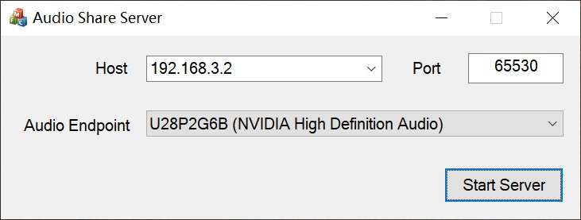
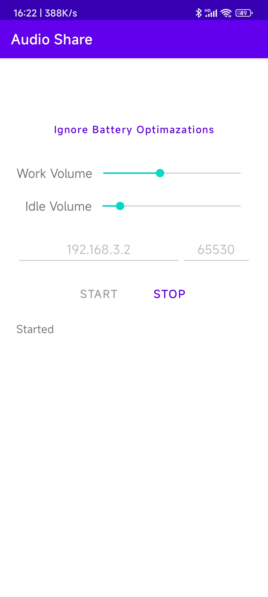

# Audio Share

Audio Share can share Windows computer's audio to Android phone over network, so your phone becomes the speaker of computer. (You needn't to buy a new speaker😄.)

## Usage

- You need a computer with Windows 10 x86_64, and a phone with Android 9.0(Pie) API 28.
- Download app-debug.apk and AudioShareServer.exe from [latest release](https://github.com/mkckr0/audio-share/releases/latest).
- Make sure AudioShareServer.exe in your computer and install app-debug.apk to your phone.
- Open AudioShareServer.exe in your computer and Audio Share app in your phone.
- Check all arguments are correct, especially the "Host" part. Make sure your phone can connect your computer over this IP.
- Click "Start Server" in AudioShareServer.exe and click "START" in app. Then enjoy the audio🎶.
> **Caution!!!**: This app doesn't support auto reconnecting feature at present. Once the app is killed  or disconnected by Android power saver, the audio playing will be stop. Adding app to the whitelist of power saver is recommended.

## Screenshot

## Compile from source

- Server side
    - vcpkg is required for install dependencies. The dependencies are below:   
    `vcpkg install asio:x64-windows-static-md protobuf:x64-windows-static-md spdlog:x64-windows-static-md`
    - Visual Studio 2022 with "Desktop development with C++" workload and "C++ MFC for latest v143 build tools (x86 & x64)" option is required for compiling.

- App side
    - Android Studio will import all dependencies automatically.
