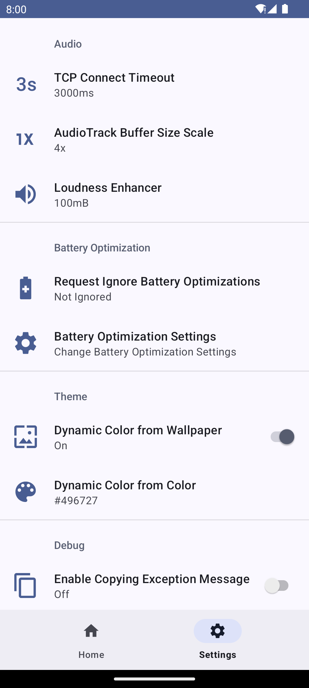

# Audio Share
<p align="center">
    
</p>

[](https://github.com/mkckr0/audio-share/releases/latest)
[](https://f-droid.org/packages/io.github.mkckr0.audio_share_app)
[](https://img.shields.io/github/license/mkckr0/audio-share)
[](https://app.fossa.com/projects/git%2Bgithub.com%2Fmkckr0%2Faudio-share?ref=badge_shield)
[](https://img.shields.io/github/release-date/mkckr0/audio-share)
[](https://img.shields.io/github/last-commit/mkckr0/audio-share)
[](https://img.shields.io/github/contributors/mkckr0/audio-share)
[](https://img.shields.io/github/commit-activity/y/mkckr0/audio-share)
[](https://img.shields.io/github/stars/mkckr0/audio-share)
[](https://img.shields.io/github/forks/mkckr0/audio-share)
[](https://img.shields.io/github/watchers/mkckr0/audio-share)
[](https://img.shields.io/github/languages/count/mkckr0/audio-share)
[](https://img.shields.io/github/languages/top/mkckr0/audio-share)
[](https://img.shields.io/github/repo-size/mkckr0/audio-share)
[](https://img.shields.io/github/downloads/mkckr0/audio-share/total)
[](https://sourceforge.net/projects/audio-share/files/latest/download)
[](https://img.shields.io/github/issues/mkckr0/audio-share)
[](https://img.shields.io/github/issues-closed/mkckr0/audio-share)
[](https://img.shields.io/github/issues-pr/mkckr0/audio-share)
[](https://img.shields.io/github/issues-pr-closed/mkckr0/audio-share)
[](https://github.com/mkckr0/audio-share/actions/workflows/release.yml)

<a href="https://f-droid.org/packages/io.github.mkckr0.audio_share_app"></a>

[](https://sourceforge.net/projects/audio-share/files)

Audio Share can share Windows/Linux computer's audio to Android phone over network, so your phone becomes the speaker of computer. (You needn't to buy a new speaker😄.)

## Requirements
- Windows 10+ x86_64 with [Microsoft Visual C++ 2015-2022 Redistributable (x64)](https://learn.microsoft.com/en-us/cpp/windows/latest-supported-vc-redist) ([vc_redist.x64.exe](https://aka.ms/vs/17/release/vc_redist.x64.exe)).
- Linux with PipeWire(0.3.xx).
- Android 6.0(API 23)+.

## Usage for Windows GUI
- Download APK file and AudioShareServer.exe from [latest release](https://github.com/mkckr0/audio-share/releases/latest).
- Open the AudioShareServer.exe on your computer. The default arguments may work well. But you may still have to check the "Host" part. It's normally the LAN address, such as `192.168.3.2`. Make sure your phone can connect your computer over this IP address. Then Click "Start Server" button.
- Install APK to your phone and open it. Modify the "Host" part to make sure it's same as the value of previous step, such as `192.168.3.2`. Click "▶" button and enjoy the audio🎶.

> **Caution!!!**: This app doesn't support auto reconnecting feature at present. Once the app is killed  or disconnected by Android power saver, the audio playing will be stop. Adding app to the whitelist of power saver is recommended.

## Usage for Windows/Linux CMD
- Download the `audio-share-server-cmd-windows.zip` for Windows, the `audio-share-server-cmd-linux.tar.gz` for Linux.
- Uncompress the archive file.
- Find the LAN address of your computer, such as `192.168.3.2`. Then run `as-cmd -b 192.168.3.2` to start the server. It will use the default port `65530` and select a default audio endpoint.
- The Windows will ask you to add firewall rules automatically while Linux not. So you need to configure firewall manually if your Linux distribution enables firewall.
```sh
sudo firewall-cmd --add-rich-rule='rule family="ipv4" destination address="192.168.3.2" port port="65530" protocol="tcp" accept'
sudo firewall-cmd --add-rich-rule='rule family="ipv4" destination address="192.168.3.2" port port="65530" protocol="udp" accept'
sudo firewall-cmd --runtime-to-permanent
```
- Install APK to your phone and open it. Modify the "Host" part to make sure it's same as the value of previous step, such as `192.168.3.2`. Click "▶" button and enjoy the audio🎶.

## Screenshot


&nbsp;


## Compile from source

- Android App
    - Android Studio will import all dependencies automatically.

- Server MFC
    - vcpkg is required for install dependencies.
    - Run `vcpkg install asio protobuf spdlog` to install deps. The vcpkg triplet is `x64-windows-static-md`.
    - Visual Studio 2022 with "Desktop development with C++" workload and "C++ MFC for latest v143 build tools (x86 & x64)" option is required for compiling.

- Server CMD
    - CMake and a compiler support C++20 is required. Linux also need `libpipewire-dev` or `pipewire-devel`.
    - Install vcpkg, and set `VPCKG_ROOT` env. This env is required by `CMakePresets.json`.
    - Run `vcpkg install asio protobuf spdlog cxxopts` to install deps. The vcpkg triplet is `x64-windows-static-md` for Windows, `x64-linux` for Linux.
    - Run `cmake --preset linux-Release` to configure.
    - Run `cmake --build --preset linux-Release` to build. The `as-cmd` is located in `out/install/linux-Release/bin/as-cmd`.
    - For Windows, replace `linux` to `windows` in previous two steps.

## Star History

[](https://star-history.com/#mkckr0/audio-share&Date)

## License
This project is licensed under the [Apache-2.0 license](https://opensource.org/license/apache-2-0) .
```
   Copyright 2022-2023 mkckr0 <https://github.com/mkckr0>

   Licensed under the Apache License, Version 2.0 (the "License");
   you may not use this file except in compliance with the License.
   You may obtain a copy of the License at

       http://www.apache.org/licenses/LICENSE-2.0

   Unless required by applicable law or agreed to in writing, software
   distributed under the License is distributed on an "AS IS" BASIS,
   WITHOUT WARRANTIES OR CONDITIONS OF ANY KIND, either express or implied.
   See the License for the specific language governing permissions and
   limitations under the License.
```

[](https://app.fossa.com/projects/git%2Bgithub.com%2Fmkckr0%2Faudio-share?ref=badge_large)

## Used third-party libraries

- [Asio](https://github.com/chriskohlhoff/asio) licensed under the [BSL-1.0 license](http://www.boost.org/LICENSE_1_0.txt).
- [Protocol Buffers](https://github.com/protocolbuffers/protobuf) licensed under the [LICENSE](https://github.com/protocolbuffers/protobuf/blob/main/LICENSE).
- [spdlog](https://github.com/gabime/spdlog) licensed under the [MIT license](https://github.com/gabime/spdlog/blob/v1.x/LICENSE).
- [{fmt}](https://github.com/fmtlib/fmt) licensed under the [LICENSE](https://github.com/fmtlib/fmt/blob/master/LICENSE).
- [cxxopts](https://github.com/jarro2783/cxxopts) licensed under the [MIT license](https://github.com/jarro2783/cxxopts/blob/master/LICENSE)
- [Netty](https://github.com/netty/netty) licensed under the [Apache-2.0 license](http://www.apache.org/licenses/LICENSE-2.0).
- [Material Components for Android](https://github.com/material-components/material-components-android) licensed under the [Apache-2.0 license](http://www.apache.org/licenses/LICENSE-2.0).
- [Protobuf Plugin for Gradle](https://github.com/google/protobuf-gradle-plugin) licensed under the [LICENSE](https://github.com/google/protobuf-gradle-plugin/blob/master/LICENSE).
- [PipeWire](https://gitlab.freedesktop.org/pipewire/pipewire) licensed under the [LICENSE](https://gitlab.freedesktop.org/pipewire/pipewire/-/blob/master/LICENSE).
