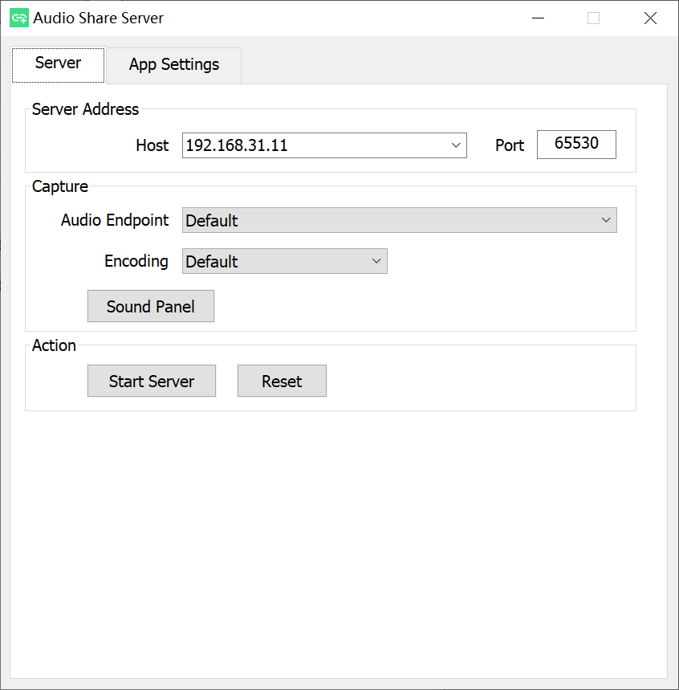
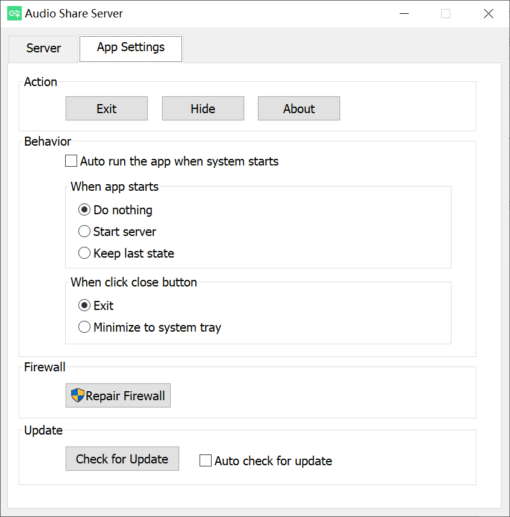
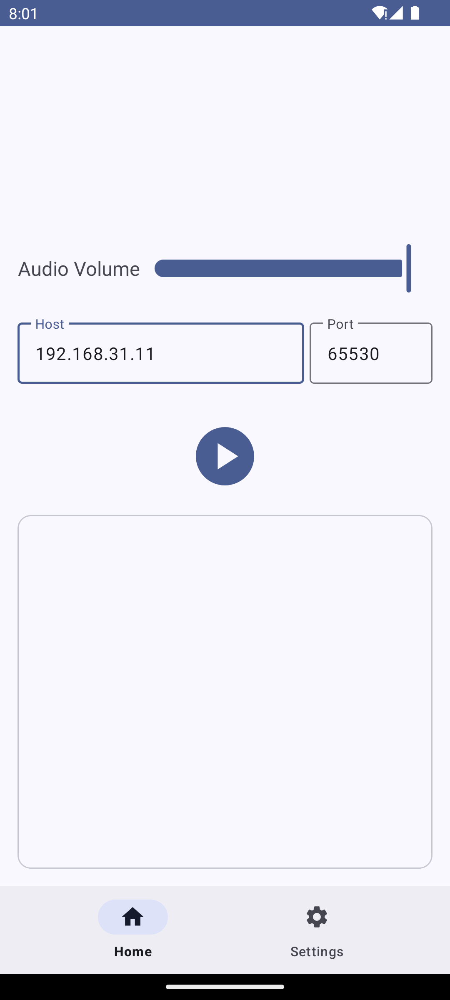

# Audio Share
<p align="center">
    
</p>

[](https://github.com/mkckr0/audio-share/releases/latest)
[](https://f-droid.org/packages/io.github.mkckr0.audio_share_app)
[](https://img.shields.io/github/license/mkckr0/audio-share)
[](https://app.fossa.com/projects/git%2Bgithub.com%2Fmkckr0%2Faudio-share?ref=badge_shield)
[](https://img.shields.io/github/release-date/mkckr0/audio-share)
[](https://img.shields.io/github/last-commit/mkckr0/audio-share)
[](https://img.shields.io/github/contributors/mkckr0/audio-share)
[](https://img.shields.io/github/commit-activity/y/mkckr0/audio-share)
[](https://img.shields.io/github/stars/mkckr0/audio-share)
[](https://img.shields.io/github/forks/mkckr0/audio-share)
[](https://img.shields.io/github/watchers/mkckr0/audio-share)
[](https://img.shields.io/github/languages/count/mkckr0/audio-share)
[](https://img.shields.io/github/languages/top/mkckr0/audio-share)
[](https://img.shields.io/github/repo-size/mkckr0/audio-share)
[](https://img.shields.io/github/downloads/mkckr0/audio-share/total)
[](https://sourceforge.net/projects/audio-share/files)
[](https://img.shields.io/github/issues/mkckr0/audio-share)
[](https://img.shields.io/github/issues-closed/mkckr0/audio-share)
[](https://img.shields.io/github/issues-pr/mkckr0/audio-share)
[](https://img.shields.io/github/issues-pr-closed/mkckr0/audio-share)
[](https://github.com/mkckr0/audio-share/actions/workflows/release.yml)
[](https://github.com/mkckr0/audio-share/milestones?state=open)

<a href="https://github.com/mkckr0/audio-share/releases/latest"></a><a href="https://f-droid.org/packages/io.github.mkckr0.audio_share_app"></a>

<a href="https://sourceforge.net/projects/audio-share/files"></a>

Audio Share can share Windows/Linux computer's audio to Android phone over network, so your phone becomes the speaker of computer. (You needn't buy a new speaker😄.)


## Screenshots

&nbsp;


&nbsp;


## Requirements
- A PC with Windows or Linux as the server.
    - Windows 10+ x86_64 with [Microsoft Visual C++ 2015-2022 Redistributable (x64)](https://learn.microsoft.com/en-us/cpp/windows/latest-supported-vc-redist) ([vc_redist.x64.exe](https://aka.ms/vs/17/release/vc_redist.x64.exe)).
    - Linux with PipeWire.
- The audio player on PC can work normally. That's to say that you should have a sound card and the audio endpoint is in available state. Otherwise, you need some [extra setups](#extra-setups-for-no-audio-endpoint).
- Android 6.0(API 23)+.


## Usage for Windows GUI
- Download APK file and AudioShareServer.exe from [latest release](https://github.com/mkckr0/audio-share/releases/latest).
- Open the AudioShareServer.exe on your computer. The default arguments may work well. But you may still have to check the "Host" part. It's normally the LAN address, such as `192.168.3.2`. Make sure your phone can connect your computer over this IP address. Then Click "Start Server" button.
- Install APK to your phone and open it. Modify the "Host" part to make sure it's same as the value of previous step, such as `192.168.3.2`. Click "▶" button and enjoy the audio🎶.

> **Caution!!!**: This app doesn't support auto reconnecting feature at present. Once the app is killed  or disconnected by Android power saver, the audio playing will be stop. Adding app to the whitelist of power saver is recommended. To do this, you can press "Request Ignore Battery Optimizations" on app's Settings.


## Usage for Windows/Linux CMD
- Download the `audio-share-server-cmd-windows.zip` for Windows, the `audio-share-server-cmd-linux.tar.gz` for Linux.
- Uncompress the archive file.
- Find the LAN address of your computer, such as `192.168.3.2`. Then run `as-cmd -b 192.168.3.2` to start the server. It will use the default port `65530` and select a default audio endpoint.
- The Windows will ask you to add firewall rules automatically while Linux won't. So if your Linux distribution enables firewall, you need to configure firewall manually.
- Install APK to your phone and open it. Modify the "Host" part to make sure it's same as the value of previous step, such as `192.168.3.2`. Click "▶" button and enjoy the audio🎶.


## Configure Firewall Rules on Linux
### Add rules
```sh
address=192.168.3.2 # change it.
port=65530 # change it.
sudo firewall-cmd --add-rich-rule="rule family=ipv4 destination address=$address port port=$port protocol=tcp accept"
sudo firewall-cmd --add-rich-rule="rule family=ipv4 destination address=$address port port=$port protocol=udp accept"
sudo firewall-cmd --runtime-to-permanent
```
### Check rules
```sh
sudo firewall-cmd --list-rich-rules
```
Output:
```sh
rule family="ipv4" destination address="192.168.3.2" port port="65530" protocol="tcp" accept
rule family="ipv4" destination address="192.168.3.2" port port="65530" protocol="udp" accept
```
### Remove rules
```sh
address=192.168.3.2 # change it.
port=65530 # change it.
sudo firewall-cmd --remove-rich-rule="rule family=ipv4 destination address=$address port port=$port protocol=tcp accept"
sudo firewall-cmd --remove-rich-rule="rule family=ipv4 destination address=$address port port=$port protocol=udp accept"
sudo firewall-cmd --runtime-to-permanent
```


## About Audio Format
There are two kinds of audio format:

- Capture audio format
- Transfer audio format

The transfer audio format is uncompressed PCM data and keep same with capture audio format.

You can open `server.log` to see the capture audio format.
```
[2024-02-11 22:27:33.019] [server] [info] AudioFormat:
format_tag: 3
channels: 2
sample_rate: 192000
bits_per_sample: 32
```
As shown above, the format is `32 bit float`, the channel count is `2`, and sample rate is `192kHz`.

On Windows, the capture audio format is the default value given by Windows Core Audio APIs. It seems like always be `32 bit float`. The sample rate is affected by audio endpoint format. You may change it by setting System Sounds Panel(`mmsys.cpl`). In `Playback` tab, right click one available endpoint, and open Properties Panel, and select `Advanced` tab, and change `Default Format` and click `Apply`. This can be also done in `Realtek Audio Console`, if you use a Realtek Audio Card.

On Linux, the capture audio format is hardcoded. To keep same with Windows, the audio format is also `32 bit float`. The channel count is always `2`. The sample rate is always `48kHz`.

Note that the higher sample rate will consume more network traffic bandwidth. Maybe in future, the capture audio format can be set by user manually.


## About Volume
The final volume that you hear is affected by the following volume:

- PC system volume.
- Audio player volume on PC.
- Android system media volume.
- "Audio Volume" on Android app.
- "Loudness Enhancer" on Android app.

**They are all independent.** If you max the volume of your PC and audio player, and still feel it's not enough, but don't want to change the Android system volume, you can increase "Loudness Enhancer" on app's Settings. It won't affect the system volume. The "Audio Volume" on app can decrease the volume you hear without changing system volume.

**Too much loudness will hurt your ear!!!** "Loudness Enhancer" has a limit of `3000mB`. It's enough for most cases. If you still need more loudness, just directly change Android system volume.


## Extra Setups for "No Audio Endpoint"
### For Windows
#### Method 1: Make audio endpoint available when speaker doesn't plug in
Realtek sound card can make audio endpoint available when speaker doesn't plug in. Just open Realtek Audio Console, select "Device advanced settings" tab, and switch on "Disable front panel front popup dialog" option. Then the audio endpoint will show up. Other sound card may have similar options. If you can't find, then turn to Method 2.

#### Method 2: Install a third-party virtual audio device driver
At present, I haven't find a way to create virtual audio endpoint. The only way to achieve it is to write a virtual audio device driver. But it need a EV Code Signing Certificate to sign it. Otherwise, user can't install it. I don't want to pay for it. And there are many existed third-party virtual audio device drivers. You can find one or post one that you know at [Virtual Audio Device Driver on Windows](https://github.com/mkckr0/audio-share/discussions/59). Generally, a driver has an INF file. Right click it and click "Install" to install it.

### For Linux
Thanks to PipeWire, it's very easy for Linux to create a virtual audio endpoint, even without a root privilege. Just copy the below config to `~/.config/pipewire/pipewire.conf.d/audio-share-sink.conf`
```
context.objects = [
    {   factory = adapter
        args = {
           factory.name     = support.null-audio-sink
           node.name        = "Audio Share Sink"
           media.class      = Audio/Sink
           object.linger    = true
           audio.position   = [ FL FR ]
           priority.session = 1009
           priority.driver  = 1009
           monitor.channel-volumes = true
           monitor.passthrough = true
        }
    }
]
```
Then run `systemctl --user restart pipewire` to restart the PipeWire service.  
Finally, you can see the added endpoint "Audio Share Sink".
```sh
[abc@localhost ~]$ as-cmd -l
[2024-03-17 22:46:14.563] [info] pipewire header_version: 0.3.48, library_version: 0.3.67
endpoint_list:
        * id: 30   name: Audio Share Sink
total: 1
```


## Compile from source

- Android App
    - Android Studio will import all dependencies automatically.

- Server MFC
    - vcpkg is required for install dependencies.
    - Run `vcpkg install asio protobuf spdlog[wchar] wil nlohmann-json` to install deps. The vcpkg triplet is `x64-windows-static-md`.
    - Visual Studio 2022 with "Desktop development with C++" workload and "C++ MFC for latest v143 build tools (x86 & x64)" option is required for compiling.

- Server CMD
    - CMake and a compiler support C++20 is required. Linux also need `libpipewire-dev` or `pipewire-devel`.
    - Install vcpkg, and set `VPCKG_ROOT` env. This env is required by `CMakePresets.json`.
    - Run `vcpkg install asio protobuf spdlog cxxopts` to install deps. The vcpkg triplet is `x64-windows-static-md` for Windows, `x64-linux` for Linux.
    - Run `cmake --preset linux-Release` to configure.
    - Run `cmake --build --preset linux-Release` to build. The `as-cmd` is located at `out/install/linux-Release/bin/as-cmd`.
    - For Windows, replace `linux` to `windows` in previous two steps.

## Star History

[](https://star-history.com/#mkckr0/audio-share&Date)

## License
This project is licensed under the [Apache-2.0 license](https://opensource.org/license/apache-2-0) .
```
   Copyright 2022-2024 mkckr0 <https://github.com/mkckr0>

   Licensed under the Apache License, Version 2.0 (the "License");
   you may not use this file except in compliance with the License.
   You may obtain a copy of the License at

       http://www.apache.org/licenses/LICENSE-2.0

   Unless required by applicable law or agreed to in writing, software
   distributed under the License is distributed on an "AS IS" BASIS,
   WITHOUT WARRANTIES OR CONDITIONS OF ANY KIND, either express or implied.
   See the License for the specific language governing permissions and
   limitations under the License.
```

[](https://app.fossa.com/projects/git%2Bgithub.com%2Fmkckr0%2Faudio-share?ref=badge_large)

## Used third-party libraries

- [nlohmann/json](https://github.com/nlohmann/json) licensed under the [MIT license](https://github.com/nlohmann/json/blob/develop/LICENSE.MIT)
- [WIL](https://github.com/microsoft/wil) licensed under the [MIT license](https://github.com/microsoft/wil/blob/master/LICENSE)
- [Asio](https://github.com/chriskohlhoff/asio) licensed under the [BSL-1.0 license](http://www.boost.org/LICENSE_1_0.txt).
- [Protocol Buffers](https://github.com/protocolbuffers/protobuf) licensed under the [LICENSE](https://github.com/protocolbuffers/protobuf/blob/main/LICENSE).
- [spdlog](https://github.com/gabime/spdlog) licensed under the [MIT license](https://github.com/gabime/spdlog/blob/v1.x/LICENSE).
- [{fmt}](https://github.com/fmtlib/fmt) licensed under the [LICENSE](https://github.com/fmtlib/fmt/blob/master/LICENSE).
- [cxxopts](https://github.com/jarro2783/cxxopts) licensed under the [MIT license](https://github.com/jarro2783/cxxopts/blob/master/LICENSE)
- [Netty](https://github.com/netty/netty) licensed under the [Apache-2.0 license](http://www.apache.org/licenses/LICENSE-2.0).
- [Material Components for Android](https://github.com/material-components/material-components-android) licensed under the [Apache-2.0 license](http://www.apache.org/licenses/LICENSE-2.0).
- [Protobuf Plugin for Gradle](https://github.com/google/protobuf-gradle-plugin) licensed under the [LICENSE](https://github.com/google/protobuf-gradle-plugin/blob/master/LICENSE).
- [PipeWire](https://gitlab.freedesktop.org/pipewire/pipewire) licensed under the [LICENSE](https://gitlab.freedesktop.org/pipewire/pipewire/-/blob/master/LICENSE).
