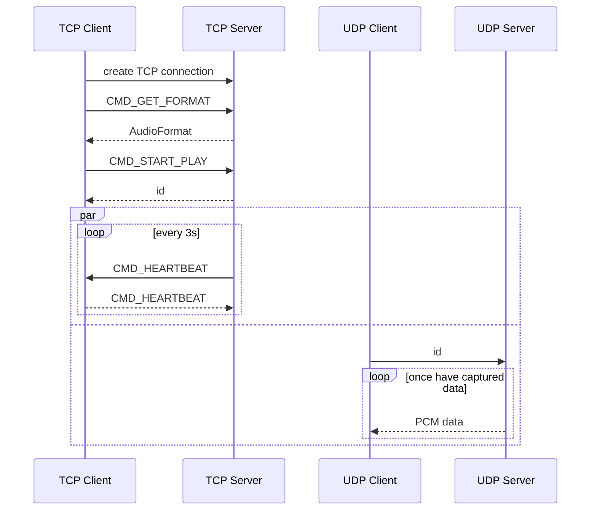

```mermaid
sequenceDiagram
    participant TCP Client
    participant TCP Server
    participant UDP Client
    participant UDP Server

    TCP Client ->> TCP Server : create TCP connection
    
    TCP Client ->> TCP Server : CMD_GET_FORMAT
    TCP Server -->> TCP Client : AudioFormat

    TCP Client ->> TCP Server : CMD_START_PLAY
    TCP Server -->> TCP Client : id
    
    par
        loop every 3s
            TCP Server ->> TCP Client : CMD_HEARTBEAT
            TCP Client -->> TCP Server : CMD_HEARTBEAT
        end
    and
        UDP Client ->> UDP Server : id
        loop once have captured data
            UDP Server -->> UDP Client : PCM data
        end
    end
```